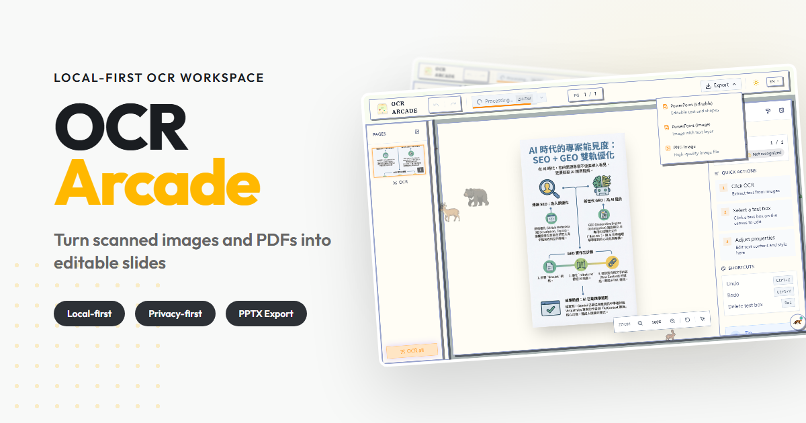
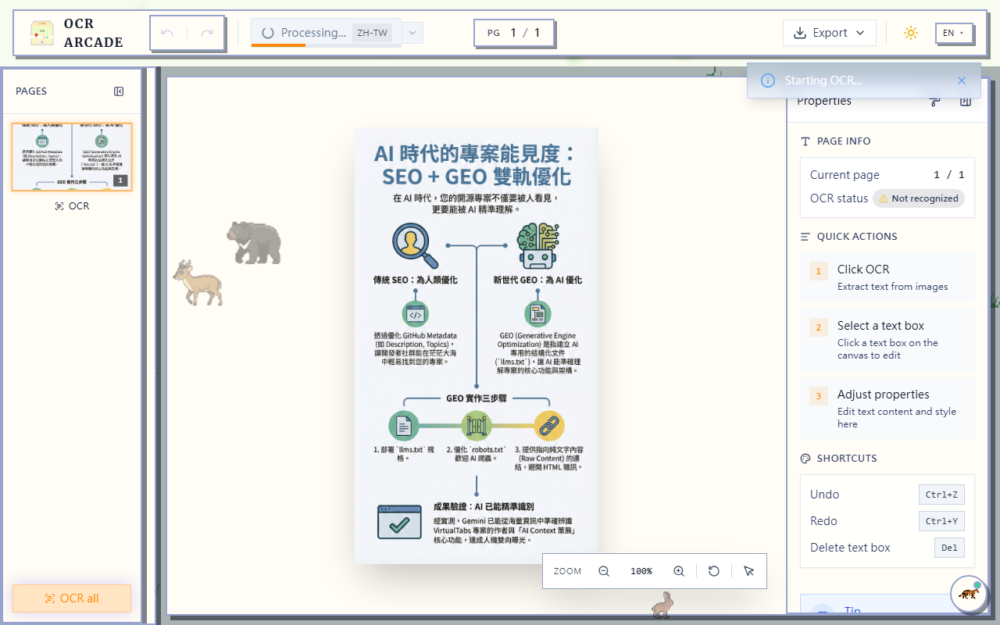
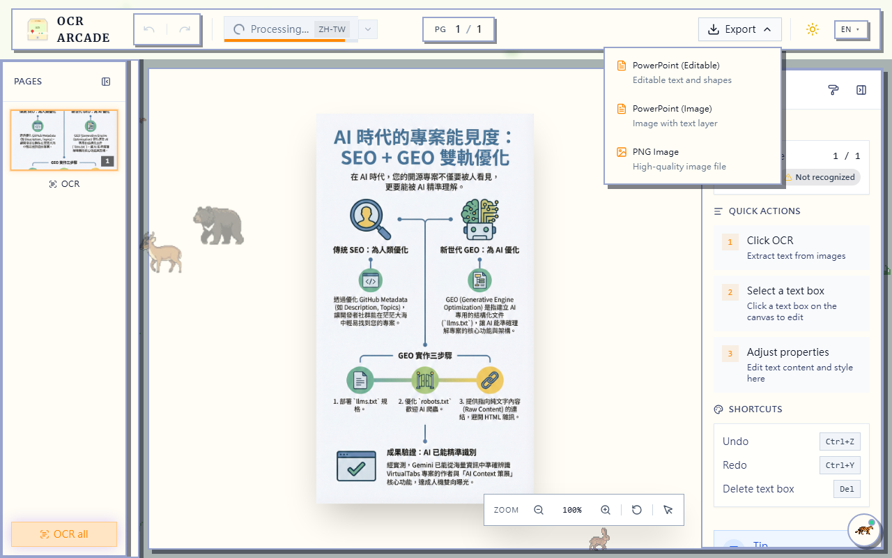
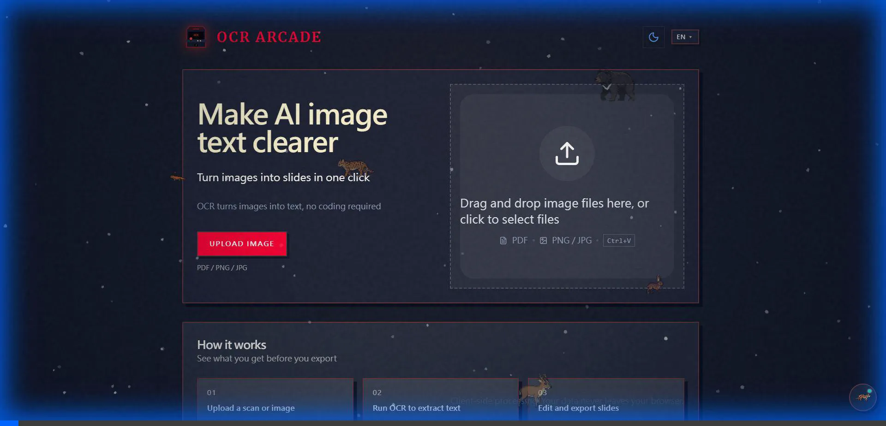

# OCR Arcade

最近我很常使用 NotebookLM 來整理資料，它生成的視覺化圖表非常有幫助。但這類 AI 工具通常只提供靜態圖片 (PNG) 或 PDF 下載，這帶來了一個很實際的問題：**內容是鎖死的**。

如果發現圖片上有錯字，或是想把圖表整合進自己的簡報裡微調排版，除了重新下 Prompt 碰運氣之外，幾乎沒有修改空間。

因為這個困擾，我開發了 **OCR Arcade**。

[](CHANGELOG.md) [](LICENSE) [](llms.txt)

[](https://winterdrive.github.io/OCR-Arcade/)

[2 分鐘本機啟動](#quick-start) · [網站](https://winterdrive.github.io/OCR-Arcade/) · [GitHub Repo](https://github.com/winterdrive/OCR-Arcade) · [English README](README.md) · [已修正問題](CHANGELOG.md)

---

## 這個工具能做什麼？

簡單來說，它幫這些「死圖」加上了一個編輯模式。

你把 NotebookLM 的截圖或 PDF 講義丟進來，它會分析版面，盡可能還原出文字方塊與圖層結構。即便辨識結果不完美，你也擁有了直接在瀏覽器上修改內容的能力，最後可以匯出成通用的 PPTX 格式。

目前我主要用它來：

1. **修正 AI 生成內容**：直接改掉視覺筆記上的錯字或錯誤數據。
2. **提取鎖死資料**：把 PDF 裡的表格或段落抓出來，變成可編輯的物件。

---

## 為什麼自己造輪子？

市面上其實已有類似的付費或免費工具，但它們絕大多數都是 **閉源 (Closed Source)** 的。

這意味著我們無法知道檔案是否被上傳，也無法依照自己的需求修改功能。

我希望能有一個完全 **Open Source** 的選擇：

1. **因為開源，所以透明**：你可以檢查每一行程式碼，確定檔案真的只在本機運算，沒有偷偷上傳。
2. **因為開源，所以自由**：如果你覺得某個功能的微調手感不對，你是可以自己改的。

這個 Side Project 是一個保有 Local-first 隱私優點，並嘗試用 Fabric.js 實作類似 PowerPoint 編輯手感的實驗品。

* **OCR**: 使用 WASM 版的 Tesseract.js。
* **Layout**: 整合 onnxruntime-web 進行版面分析。

---

## 功能概覽

這是一個仍在持續開發中的 Side Project，目前已實作：

* **多格式支援**：可吃 PDF、PNG、JPG，也支援直接貼上剪貼簿。
* **視覺化編輯**：左邊選頁面，中間改文字，右邊調參數。我盡量讓操作邏輯接近 PowerPoint。
* **PPTX 匯出**：依賴 `PptxGenJS`，匯出的檔案可以直接在 Keynote 或 Google Slides 開啟。
* **多語系**：順手做了 i18n，目前包含繁體中文介面。

---

## 實際畫面

### 1. 識別與還原

將圖片拖曳進來後，系統會自動切分文字區塊。


### 2. 修正內容

這是我最常用的功能：直接點兩下文字方塊修錯字。



### 3. 下載檔案

調整完畢後，匯出成 PPTX 繼續後續工作。



---

## 動態展示 (Feature Demos)

### 進階編輯器互動 (Advanced Editor Interactions)


### PDF 長文件處理 (PDF Workflow)


### 多語系切換 (Localization)



---

## Quick Start

如果你想在本地跑起來玩玩看：

### 環境需求

* Node.js >= 18
* npm >= 9

### 啟動指令

```bash
# 安裝依賴
npm install

# 啟動開發伺服器
npm run dev
```

---

## 技術筆記

整個專案是純前端架構 (React 19 + Vite)，沒有後端資料庫。
畫布互動層是用 Fabric.js 刻的，這部分花了不少時間處理縮放與選取的細節交互。

如果你對 Image-to-Slide 的還原算法有興趣，或者發現了什麼 Bug，歡迎直接開 Issue 或 PR 給我。

---

## 特別致謝 (Special Thanks)

感謝 [**JBB-GAARA**](https://github.com/JBB-GAARA) 在本專案中擔任 PM 與設計師，協助梳理產品方向與介面設計。

---

## License

本專案採用 **AGPL-3.0** 開源授權。
如果你是個人使用或開發開源軟體，請隨意使用。若涉及商業閉源產品的整合，請另外參閱 `COMMERCIAL-LICENSE.md`。
